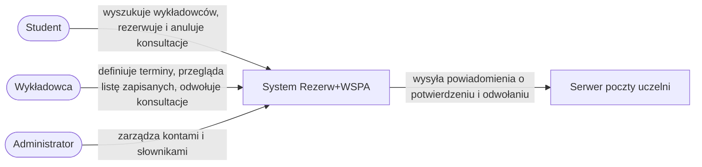

# Diagram kontekstu

```mermaid
flowchart LR
    S([Student]) -->|wyszukuje wykładowców, rezerwuje i anuluje konsultacje| RW[System Rezerw+WSPA]
    W([Wykładowca]) -->|definiuje terminy, przegląda listę zapisanych, odwołuje konsultacje| RW
    A([Administrator]) -->|zarządza kontami i słownikami| RW
    RW -->|wysyła powiadomienia o potwierdzeniu i odwołaniu| E[Serwer poczty uczelni]
```
